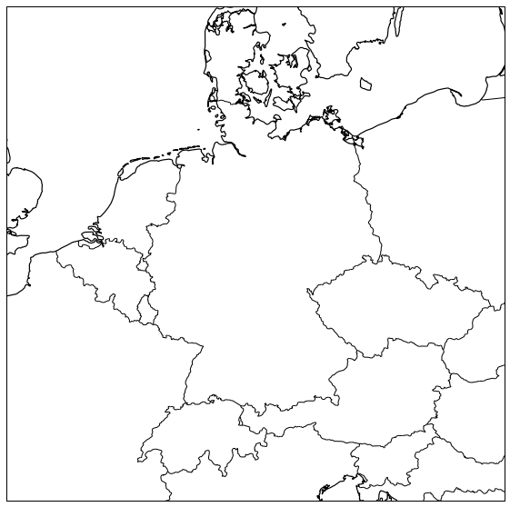

# CartoPy Guide

Cartopy is a new map plotting tool/package for python3.X
and has replaced the basemap package.



## Installation

### Conda
```bash
conda env create -f environment.yml

conda activate cartopy
```

Add to notebook:

```bash
conda install -c anaconda ipykernel
python -m ipykernel install --user --name=cartopy
```
See for more information here:
https://scitools.org.uk/cartopy/docs/latest/installing.html#installing

### Requirements
Python 3.9 or higher 

##### Required packages
- Matplotlib 3.4
- Shapely 1.7.1
- pyshp 2.1
- pyproj 3.1.0
- pytest 5.1.2 (needed for full testing)
- pytest-mpl 0.11

### Shapes and shapereader

How to add a background to you plots like topography, boundaries of states 
or infrastructure are explained here:
https://scitools.org.uk/cartopy/docs/v0.15/tutorials/using_the_shapereader.html

A short summary what you have to do:
1. Chose a shapefile of you desire here: https://www.naturalearthdata.com/downloads/
2. Save the shapefile on any kind of hard disk.
2. Imoprt: `import cartopy.io.shapereader as shpreader`
3. Load the shapefile into your script and add it to you plot:

```python
shapename = 'your_shape_file'
adm1_shapes = list(shpreader.Reader(shapename).geometries())
ax.add_geometries(adm1_shapes, crs.PlateCarree(), edgecolor='?',facecolor='?')
```
or
```python
shapename = 'your_shape_file'
prob_shp = shpreader.natural_earth(resolution='110m', category='cultural', name=shapename)
ax.add_geometries(shpreader.Reader(prob_shp).geometries(),
        ccrs.PlateCarree())
```
